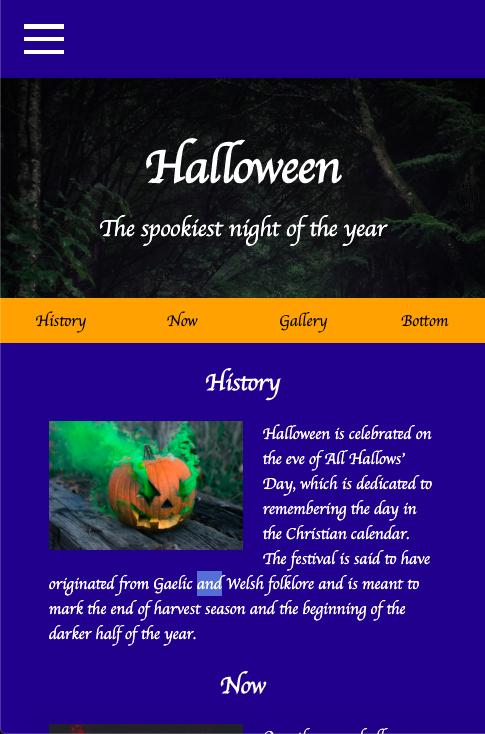
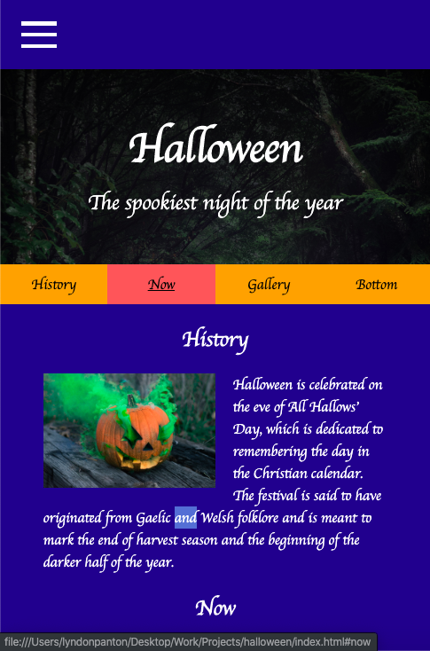
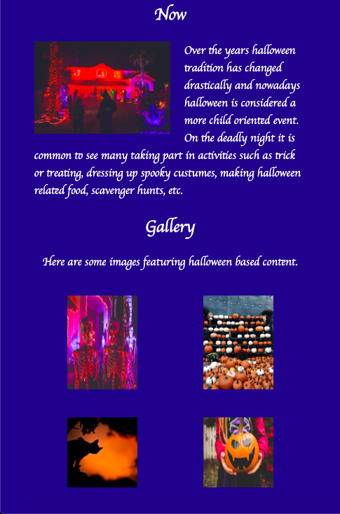
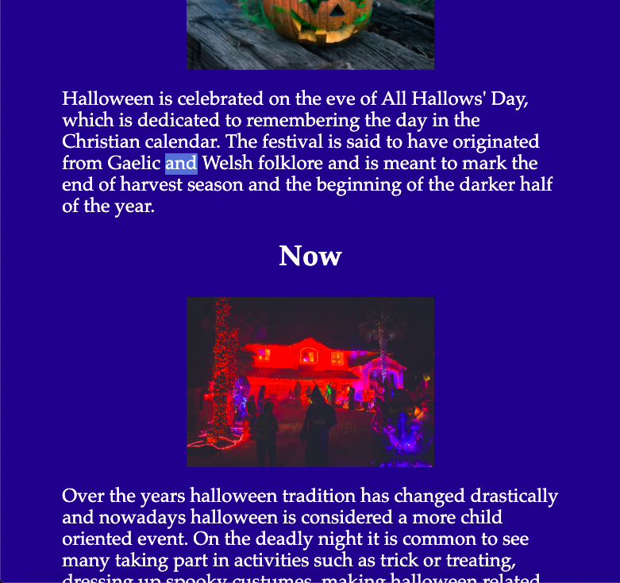
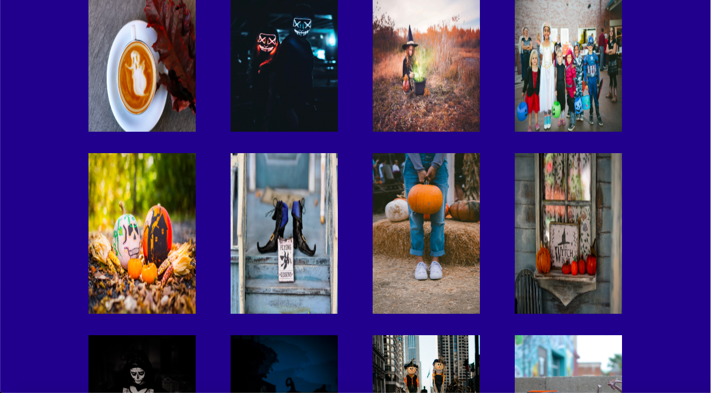
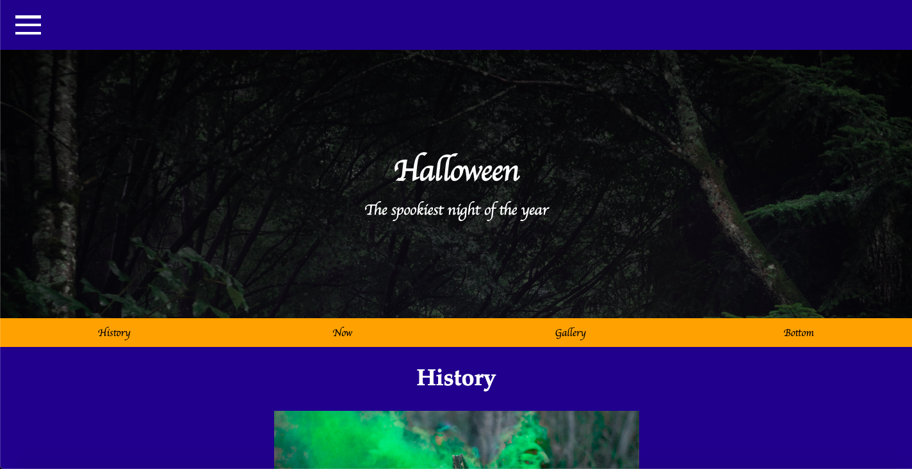

# Halloween

## How To Open
> 1. Go to the project's download folder
> 2. Right click on the file named _index.html_
> 3. Choose the _open with_ option
> 4. Open the project in your desired browser

## How To Use
> 1. Use navigation items to go to desired sections

## Requirements
> 1. This project requires a browser to run
> 2. That browser requires JavaScript to be available and enabled to run

## User Stories
> 1. Users can view a responsive page
> 2. Users can user navigation items to view different page sections

## Preview

